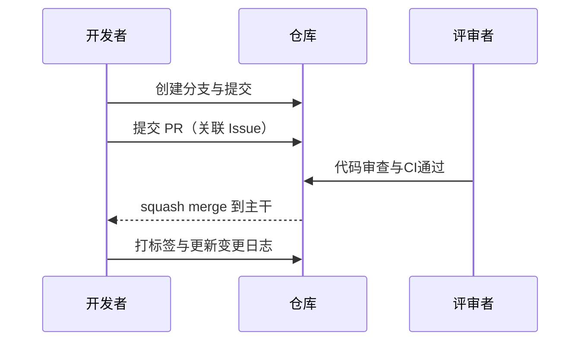

# PR/Git 使用规范

版本：v1.1.0  
最后更新时间：2025-12-12  
适用范围：deep main html 与 支付 项目相关仓库

---

## 目录
- [PR 规范](#pr-规范)
  - [标题格式](#标题格式)
  - [PR 说明模板](#pr-说明模板)
  - [代码审查标准](#代码审查标准)
  - [修改记录（自 12 月 8 日起）](#修改记录自-12-月-8-日起)
- [Git 规范](#git-规范)
  - [分支命名规则](#分支命名规则)
  - [提交信息格式](#提交信息格式)
  - [合并策略](#合并策略)
  - [回滚与冲突解决指南](#回滚与冲突解决指南)
  - [变更记录（自 12 月 8 日起）](#变更记录自-12-月-8-日起)
- [示例与流程图](#示例与流程图)
- [版本与历史](#版本与历史)

---

## PR 规范
### 标题格式
- `[模块名] 简要描述修改内容`
- 示例：
  - `[payment] 对齐支付发起与回调地址`
  - `[frontend] 升级按钮触发支付并重定向`

### PR 说明模板
```markdown
# [模块名] 简要描述修改内容

## 背景与目的
- 为什么改：问题/需求来源、相关链接（Issue #123）

## 主要变更点与技术方案
- 变更点列表（接口、参数、数据结构、UI）
- 技术方案与权衡（兼容性、最小改动优先）

## 影响范围与风险评估
- 受影响模块/页面/脚本
- 风险与缓解（回滚路径、开关、监控）

## 测试与验证
- 用例说明、覆盖边界、命令
- 结果与截图/日志

## 关联任务/Issue
- Issue: #123, #456
- 需求文档/规格链接
```

### 代码审查标准
- 规范一致：缩进、命名、文件结构与导入顺序统一
- 契约正确：请求/响应字段、状态码与路由路径与文档一致
- 安全无漏洞：鉴权、CORS、密钥管理、日志脱敏、签名校验
- 性能与鲁棒：避免重复计算/调用、合理缓存、异常分支落库与告警
- 可读与可维护：函数粒度适中、注释与日志明确、避免死代码/冗余依赖
- 测试与边界：覆盖成功/失败、异常与并发边界，集成测试可重复

### 修改记录（自 12 月 8 日起）
> 来源：工作区操作与当前代码差异；时间按发生顺序记录。

| 日期 | 模块 | 内容 | 相关文件 | 类型 |
|---|---|---|---|---|
| 2025-12-12 | frontend | 将升级按钮调用改为 `POST /payment/initiate`，透传 `Authorization` 与 `redirectUrl`，使用 `paymentUrl` 跳转 | `frontend/src/pages/chat.tsx:151–169` | fix/feat |
| 2025-12-12 | payment | 统一下单参数新增 `callback_url`，优先使用请求值；`bank_code` 与 `provider` 对齐 | `apps/server/controllers/payment_controller.py:103–110`，`apps/server/services/lspay_service.py:93–94` | feat |
| 2025-12-12 | docs | 新增《支付系统技术与流程规范》与目录说明、整理报告 | `支付/docs/支付系统技术与流程规范.md`、`支付/docs/文件结构说明.md`、`支付/docs/整理报告.md` | docs |
| 2025-12-12 | scripts | 新增文件整理助手（dry-run/apply/undo），并归档测试/脚本/日志与数据 | `支付/scripts/organizer.py` | chore |
| 2025-12-12 | tests | 规范化 `支付/tests/` 目录结构，清理无关第三方测试文件 | `支付/tests/integration/*` | chore |
| 2025-12-12 | frontend(web) | 修复类型与错误打印、删除未用组件、对齐接口类型 | `apps/web/src/*` | fix/style |

> 注：如有 12 月 8–11 日的历史改动需补齐，可在本表后续追加对应记录（来源以 Git 历史或任务单为准）。

---

## Git 规范
### 分支命名规则
- `feature/<简述>`：新功能（示例：`feature/payment-initiate`）
- `bugfix/<简述>`：缺陷修复（示例：`bugfix/callback-verify-fail`）
- `hotfix/<简述>`：紧急线上修复（示例：`hotfix/revert-wrong-gateway`）
- `docs/<简述>`：文档与说明（示例：`docs/payment-spec`）
- `chore/<简述>`：脚手架/依赖/脚本（示例：`chore/organizer-script`）

### 提交信息格式
- 遵循 Conventional Commits：`<type>(<scope>): <subject>`
- 类型：`feat`/`fix`/`docs`/`style`/`refactor`/`test`/`chore`
- 示例：
```text
feat(payment): propagate redirectUrl to LSPay callback
fix(frontend): use /payment/initiate and redirect via paymentUrl
chore(scripts): add organizer.py with dry-run/apply/undo
```

### 合并策略
- 默认 `squash merge`：压缩提交、保持主干历史整洁
- 需要保留细粒度历史时使用 `merge commit`（需评估）
- `rebase` 用于本地更新分支，提交前确保线性历史、解决冲突
- PR 必须通过 CI 与评审；每个 PR 关联 Issue/任务编号

### 回滚与冲突解决指南
- 回滚
```bash
# 回滚单个提交
git revert <commit_sha>
# 回滚一段范围
git revert <old_sha>..<new_sha>
```
- 重置（谨慎，避免主干使用）
```bash
git reset --hard <commit_sha>
```
- 冲突解决
```bash
# 拉取时使用 rebase 保持线性
git pull --rebase origin <branch>
# 逐文件解决冲突后继续
git add <file>
git rebase --continue
```
- 保护主干：主干仅允许通过 PR 合并；禁止直接 push

### 变更记录（自 12 月 8 日起）
- 同 PR 规范中的“修改记录”表保持一致，并在每次合并时追加到 `CHANGELOG` 或本章节。

---

## 示例与流程图
- PR 流程图（Mermaid）：


---

## 版本与历史
- 文档版本：v1.1.0（最后更新时间：2025-12-12）
- 重大变更：
  - 新增 PowerShell 脚本审查与强制测试要求（适用于 `start_all_services.ps1`、`check_services.ps1`）
  - 新增支付模块双重审查、安全与流程完整性清单、文档同步要求
  - 新增虚拟环境/配置提交约束与影响范围标注规范
  - 新增统一提交流程与预提交检查清单、回滚与冲突解决指南的细化示例
- 历史版本存档：后续版本以 `PR_GIT_规范_vX.Y.Z.md` 方式归档

> 维护说明：每次合并 PR 后，需更新“修改记录/变更记录”，并将 PR 标题与 Issue 编号同步登记。

---

## PowerShell 脚本审查与测试
- 适用文件：`start_all_services.ps1`、`check_services.ps1`
- 错误处理：使用 `try/catch/finally`；外部命令返回码校验；失败时明确 `Write-Error` 与退出码
- 日志记录：统一前缀与颜色（启动、成功/失败、路径/端口）；避免静默失败
- 最佳实践：参数化路径与端口（`Join-Path`、`Resolve-Path`）；加入超时与重试；函数化便于测试
- 强制测试用例：
  - `start_all_services.ps1`：对每个服务启动的返回码断言；模拟端口占用与失败回退
  - `check_services.ps1`：净化 `netstat -ano` 解析，避免 `30000` 误匹配 `3000`
- 测试执行示例：
```powershell
pwsh -File tests\scripts\test_start_all_services.ps1
pwsh -File tests\scripts\test_check_services.ps1
```

## 支付模块审查（双重审查）
- 安全与合规：禁止提交密钥/`.env`；生产 CORS 收敛；日志脱敏；严格签名与鉴权（Authorization 必须校验）
- 流程完整性：发起 → 网关页 → 支付网关 → 浏览器回跳 → 服务器回调 → 订阅更新 → WS 广播
- 测试覆盖：后端集成（`py tests\test_payment_integration.py` 必须通过）、前端契约（升级按钮成功/失败与回跳参数）
- 文档同步：更新 `支付/docs/支付系统技术与流程规范.md` 与相关 API 说明；追加变更日志
- 审查要求：至少 2 名核心成员批准，其中 1 名具备支付/安全背景

## 虚拟环境与配置提交约束
- `.venv`：统一 `.gitignore` 排除虚拟环境与缓存；依赖升级需注明影响范围与回滚方案
- `.trae`：仅提交必要配置与计划文档；禁止机密信息
- 提交信息需标注影响范围示例：`chore(.venv): 升级依赖 (影响: dev)`

## 统一提交流程与检查清单
- 流程命令：
```bash
git status
git add <files>  # 或 git add .
git commit -m "<类型(范围): 描述>" -m "<详细说明>" -m "Refs: #123"
git push -u origin <branch>
```
- 预提交检查：代码（脚本错误处理与日志；支付安全与契约；`.venv/.trae` 无敏感）/测试（后端集成、前端构建与 Linter、脚本测试）/文档（支付规范与日志更新）

## 回滚与冲突解决指南（细化示例）
- 回滚：
```bash
git revert <commit_sha>
git revert <old_sha>..<new_sha>
```
- 冲突解决：
```bash
git pull --rebase origin <branch>
# 解决冲突后
git add <file>
git rebase --continue
```

## 示例提交信息集合
```text
feat(支付): 新增微信支付接口 (签名与回调对齐, 测试通过) #456
fix(start_all_services.ps1): 增加启动超时与重试, 输出统一日志 #321
test(check_services.ps1): 添加端口解析与误匹配用例
docs(.trae): 同步启动与健康检查指南
chore(.venv): 更新依赖并清理缓存 (影响: dev)
```
