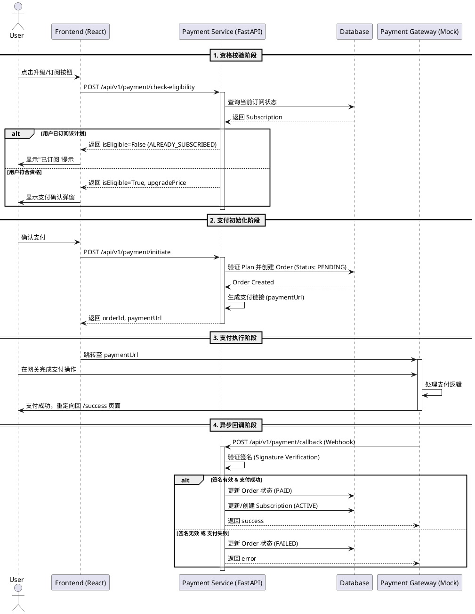

# 支付系统架构设计

本文档详细描述了多租户计费支付系统的架构设计、智能体协作流程及异常处理机制。

## 1. 支付系统流程图

系统涉及前端应用（Frontend）、支付服务（Payment Service）、以及模拟支付网关（Mock Alipay Gateway）的交互。

## 2. 智能体协作时序 (Frontend/Backend Agent)

在 Deep Agent 开发模式下，前端智能体（Frontend Agent）与后端智能体（Backend Agent）通过明确的契约（Contract）进行协作。

### 协作流程

1.  **契约定义 (Contract Definition)**
    *   **Backend Agent** 首先根据需求草拟 API 接口规范（如 `schemas.py` 定义请求/响应模型）。
    *   双方确认接口路径：`/check-eligibility`, `/initiate`, `/callback`。
    *   双方确认数据字段：`planId`, `amount`, `orderId`, `status` 等。

2.  **并行开发 (Parallel Development)**
    *   **Backend Agent**:
        *   实现数据库模型 (`models.Order`, `models.Subscription`)。
        *   实现业务逻辑 (`payment_controller.py`)。
        *   提供 Mock 接口供前端早期测试。
    *   **Frontend Agent**:
        *   根据 API 定义生成 TypeScript 类型 (`api.ts`)。
        *   构建 UI 组件 (`PricingModal`, `CheckoutPage`)。
        *   使用 Mock 数据或 Mock Server 进行界面交互测试。

3.  **联调与集成 (Integration)**
    *   前端智能体调用真实的后端开发环境接口。
    *   后端智能体观察日志，修正参数解析或逻辑错误。
    *   双方共同验证端到端流程（从点击订阅到支付成功）。

## 3. 异常处理流程

系统针对支付过程中的关键节点设计了防御性的异常处理机制。

### 3.1 资格校验异常 (Eligibility Check Failed)
*   **场景**: 用户尝试订阅一个不存在的计划，或降级到一个不允许的计划。
*   **处理**:
    *   **后端**: 抛出 `HTTP 400 Bad Request` 或返回 `isEligible=False` 并附带 `reason` 字段。
    *   **前端**: 捕获错误，在 UI 上显示具体的不可用原因（如"您当前已是该等级会员"），禁用支付按钮。

### 3.2 支付初始化失败 (Initiation Failed)
*   **场景**: 数据库连接失败、生成订单失败、或参数校验错误。
*   **处理**:
    *   **后端**: 记录详细错误日志 (`logger.error`)，向前端返回 `HTTP 500` 或 `HTTP 400`。
    *   **前端**: 显示通用的"系统繁忙，请稍后再试"提示，允许用户重试。

### 3.3 回调签名错误 (Signature Verification Failed)
*   **场景**: 恶意攻击者伪造支付回调请求，或密钥配置不匹配。
*   **处理**:
    *   **后端**: 
        1.  校验请求头或参数中的 `signature`。
        2.  如果校验失败，立即终止处理。
        3.  返回 `HTTP 400 Invalid Signature`。
        4.  **不**更新订单状态，**不**发放权益。
        5.  记录安全警报日志。

### 3.4 支付超时 (Payment Timeout)
*   **场景**: 用户打开支付页面后长时间未操作，导致订单过期（如 15 分钟）。
*   **处理**:
    *   **后端**: 定时任务（或惰性检查）扫描 `PENDING` 状态且 `expire_at` 已过期的订单，将其标记为 `EXPIRED`。
    *   **前端**: 如果用户在过期后尝试支付，网关应提示"订单已失效"，引导用户重新发起订阅。
