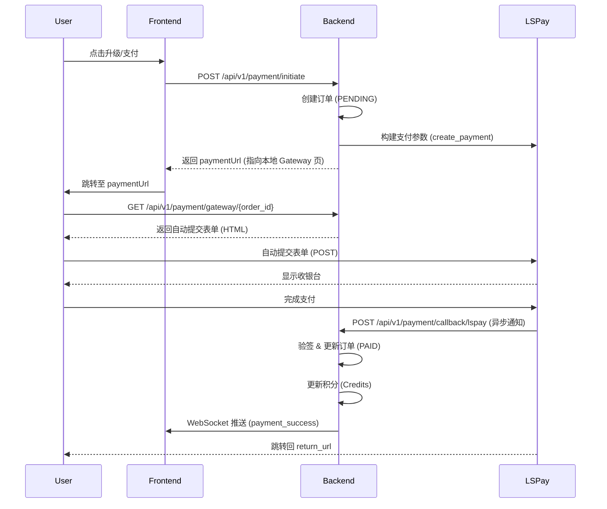

# 立收通 (LSPay) 支付集成技术规范

## 1. 简介
本文档描述了系统与立收通 (LSPay) 支付网关的集成细节，包括统一下单、异步回调、签名算法及异常处理。

## 2. 架构设计



## 3. API 接口说明

### 3.1 统一下单 (Unified Order)
后端封装参数并生成签名，通过 HTML 表单 POST 提交至 LSPay。

**关键参数**:
- `pay_memberid`: 商户号
- `pay_orderid`: 商户订单号 (UUID)
- `pay_amount`: 金额 (元)
- `pay_notifyurl`: 服务端回调地址
- `pay_callbackurl`: 页面跳转地址
- `pay_md5sign`: MD5 签名

### 3.2 签名算法
算法遵循 `key=value` 排序拼接后 MD5 加密：
1. 筛选非空参数。
2. 按参数名 ASCII 码从小到大排序。
3. 拼接格式：`key1=value1&key2=value2...`
4. 拼接密钥：`...&key=APP_KEY`
5. MD5 运算并转大写。

### 3.3 异步通知 (Callback)
**Endpoint**: `/api/v1/payment/callback/lspay`
**Method**: POST (Form Data)

**处理逻辑**:
1. 获取所有 POST 参数。
2. 验证签名 (`verify_sign`)。
3. 检查 `returncode` 是否为 `00`。
4. 校验 `pay_orderid` 是否存在且金额匹配。
5. 更新订单状态为 `PAID`。
6. 触发积分更新事件。

## 4. 异常处理
- **签名错误**: 记录日志并返回 `fail`。
- **订单不存在**: 记录日志并返回 `fail`。
- **金额不匹配**: 记录安全日志，人工介入。
- **支付失败**: 更新订单状态为 `FAILED`。

## 5. 配置说明
环境变量 (`.env`):
```bash
LSPAY_API_BASE_URL=https://api.lspay.tech
LSPAY_MEMBER_ID=your_member_id
LSPAY_APP_KEY=your_app_key
LSPAY_NOTIFY_URL=http://your-domain.com/api/v1/payment/callback/lspay
LSPAY_CALLBACK_URL=http://your-domain.com/payment/success
```
