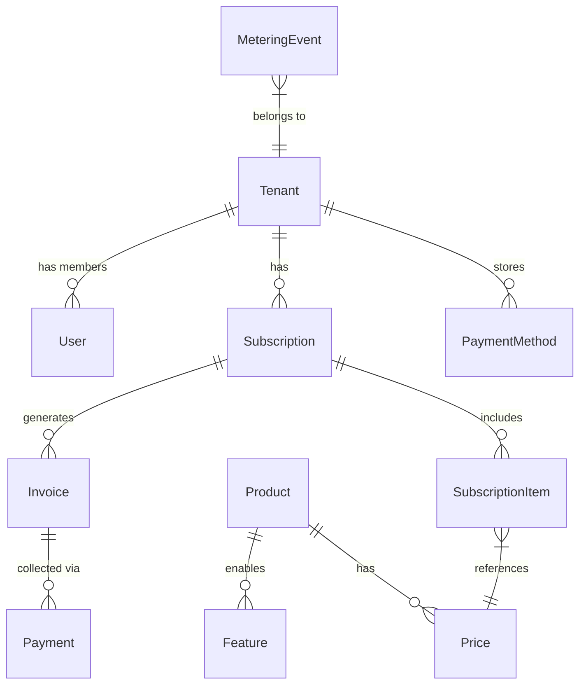

# 多租户计费系统技术架构文档

## 1. 架构概览 (Architecture Overview)

本系统采用微服务模块化的单体架构（Modular Monolith），核心围绕 **计费引擎 (Billing Engine)**、**计量服务 (Metering Service)** 和 **支付路由 (Smart Routing)** 构建。

### 1.1 系统架构图

```mermaid
graph TD
    Client[客户端 (Web/SDK)] --> API_GW[API Gateway / Load Balancer]
    
    subgraph "应用服务层 (Application Layer)"
        API_GW --> Auth[认证服务 (Auth Service)]
        API_GW --> Core[核心业务服务 (Core Service)]
        API_GW --> Metering[计量服务 (Metering Service)]
        API_GW --> Webhook[Webhook 服务]
    end

    subgraph "核心领域层 (Domain Layer)"
        Core --> BillingEngine[计费引擎 (Billing Engine)]
        Core --> SmartRouter[支付路由 (Smart Routing)]
        Core --> Entitlement[权益控制 (Entitlements)]
    end

    subgraph "基础设施层 (Infrastructure Layer)"
        DB_Main[(PostgreSQL - 业务数据)]
        DB_TS[(TimescaleDB - 计量数据)]
        Cache[(Redis - 缓存/队列)]
        Worker[异步任务 Worker (Celery)]
    end

    subgraph "外部服务 (External Services)"
        Stripe[Stripe API]
        Paddle[Paddle API]
        Email[邮件服务]
    end

    %% Data Flows
    Auth --> DB_Main
    Core --> DB_Main
    Core --> Cache
    Metering --> DB_TS
    BillingEngine --> SmartRouter
    SmartRouter --> Stripe
    SmartRouter --> Paddle
    Worker --> Webhook
    Worker --> Email
    Worker --> BillingEngine
```

## 2. 技术栈选型 (Technology Stack)

| 组件 | 选型 | 说明 |
| :--- | :--- | :--- |
| **后端框架** | **Python 3.11 + FastAPI** | 高性能异步框架，适合高并发 API 和 I/O 密集型任务。 |
| **主数据库** | **PostgreSQL 16** | 存储用户、组织、订阅、产品目录等关系型数据。 |
| **时序数据库** | **TimescaleDB** | 基于 PG 的时序扩展，存储海量计量事件 (Metering Events)。 |
| **缓存/消息** | **Redis 7** | 用于 API 缓存、分布式锁、Celery 任务队列。 |
| **异步任务** | **Celery** | 处理订阅续费、发票生成、Webhook 重试等后台任务。 |
| **支付网关** | **Stripe + Paddle** | 双渠道策略，通过智能路由优化通过率和成本。 |
| **ORM** | **SQLAlchemy (Async)** | 强大的 ORM，支持异步数据库操作。 |
| **部署** | **Docker + Kubernetes** | 容器化部署，支持弹性伸缩。 |

## 3. 核心模块设计 (Core Modules Design)

### 3.1 计量系统 (Metering System)

负责接收、存储和聚合用户的使用量数据，是按量计费的基础。

*   **数据流**: SDK/API -> Ingest API -> Kafka/Redis Stream -> Consumer -> TimescaleDB.
*   **幂等性**: 每个 Event 必须包含 `idempotency_key`，系统通过 Redis 校验 24 小时内的重复请求。
*   **存储设计 (TimescaleDB)**:
    *   `metering_events`: Hypertable，按时间分片存储原始事件。
    *   `Continuous Aggregates`: 自动维护按小时、按天的聚合视图 (Sum, Max, Count)，加速计费查询。

### 3.2 智能支付路由 (Smart Routing)

为了提高支付成功率并降低成本，系统在发起支付时动态选择网关。

*   **路由策略**:
    1.  **币种优先**: 美元 (USD) 优先走 Stripe，部分欧洲货币走 Paddle。
    2.  **地区合规**: 需代扣税 (Merchant of Record) 的地区走 Paddle。
    3.  **容灾降级**: 若 Stripe 接口报错或超时，自动切换至 Paddle 重试。
*   **抽象层**: 定义统一的 `PaymentProvider` 接口，屏蔽 Stripe/Paddle 的 API 差异。

### 3.3 计费引擎 (Billing Engine)

核心调度器，负责计算费用、生成账单和处理续费。

*   **周期任务**: 每日扫描 `subscriptions` 表，查找即将到期或需要结算的订阅。
*   **费用计算**:
    *   `Flat Fee`: 直接读取 Price 配置。
    *   `Usage Fee`: 查询 TimescaleDB 获取周期内的聚合用量 * 单价。
*   **状态机**: 管理订阅状态 (Active -> PastDue -> Unpaid -> Canceled) 和发票状态 (Draft -> Open -> Paid/Void)。

## 4. 数据模型设计 (Data Model)

### 4.1 核心实体关系 (ER Diagram)



### 4.2 数据库表设计 (Schema Definitions)

#### 4.2.1 租户与用户 (Identity)

**organizations (租户)**
| 字段 | 类型 | 说明 |
| :--- | :--- | :--- |
| `id` | UUID | 主键 |
| `name` | VARCHAR | 组织名称 |
| `billing_email` | VARCHAR | 财务联系邮箱 |
| `tax_id` | VARCHAR | 税号 (VAT/GST) |
| `stripe_customer_id` | VARCHAR | Stripe 客户映射 |
| `paddle_customer_id` | VARCHAR | Paddle 客户映射 |

#### 4.2.2 产品目录 (Catalog)

**products**
| 字段 | 类型 | 说明 |
| :--- | :--- | :--- |
| `id` | UUID | 主键 |
| `name` | VARCHAR | 产品名 (e.g. "Pro Plan") |
| `type` | ENUM | `service`, `good` |

**prices**
| 字段 | 类型 | 说明 |
| :--- | :--- | :--- |
| `id` | UUID | 主键 |
| `product_id` | UUID | FK |
| `currency` | CHAR(3) | 币种 (USD, CNY) |
| `amount` | DECIMAL | 金额 (单位: 分/cent) |
| `type` | ENUM | `recurring`, `one_time` |
| `billing_scheme` | ENUM | `per_unit`, `tiered` (阶梯定价) |
| `recurring_interval` | VARCHAR | `month`, `year` |

#### 4.2.3 订阅与计费 (Billing)

**subscriptions**
| 字段 | 类型 | 说明 |
| :--- | :--- | :--- |
| `id` | UUID | 主键 |
| `organization_id` | UUID | FK |
| `status` | ENUM | `active`, `past_due`, `canceled`... |
| `current_period_start` | TIMESTAMP | 周期开始时间 |
| `current_period_end` | TIMESTAMP | 周期结束时间 |
| `cancel_at_period_end` | BOOLEAN | 是否周期末自动取消 |

**invoices (发票/账单)**
| 字段 | 类型 | 说明 |
| :--- | :--- | :--- |
| `id` | UUID | 主键 |
| `subscription_id` | UUID | FK |
| `amount_due` | DECIMAL | 应付金额 |
| `amount_paid` | DECIMAL | 实付金额 |
| `status` | ENUM | `draft`, `open`, `paid`, `void`, `uncollectible` |
| `hosted_invoice_url` | VARCHAR | 在线支付/查看链接 |

#### 4.2.4 计量数据 (Metering - TimescaleDB)

**metering_events (Hypertable)**
```sql
CREATE TABLE metering_events (
    time        TIMESTAMPTZ       NOT NULL,
    event_id    UUID              DEFAULT gen_random_uuid(),
    org_id      UUID              NOT NULL, -- Tenant ID
    event_type  TEXT              NOT NULL, -- e.g. 'api_call', 'storage_gb'
    value       DOUBLE PRECISION  NOT NULL, -- e.g. 1, 10.5
    properties  JSONB             DEFAULT '{}',
    
    UNIQUE (event_id, time) -- Idempotency check usually done via Redis before insert
);

-- 转换为 Hypertable
SELECT create_hypertable('metering_events', 'time');

-- 创建连续聚合视图 (Continuous Aggregate)
CREATE MATERIALIZED VIEW metering_hourly_summary
WITH (timescaledb.continuous) AS
SELECT
    time_bucket('1 hour', time) AS bucket,
    org_id,
    event_type,
    SUM(value) as total_usage,
    MAX(value) as max_usage,
    COUNT(*) as event_count
FROM metering_events
GROUP BY bucket, org_id, event_type;
```

## 5. API 设计规范 (API Standards)

遵循 RESTful 风格，所有 API 位于 `/api/v1` 下。

### 5.1 计量上报 API

**POST /api/v1/events**

```json
{
  "event_name": "api_request",
  "timestamp": "2023-10-27T10:00:00Z",
  "properties": {
    "region": "us-east-1"
  },
  "idempotency_key": "evt_123456789"
}
```

### 5.2 订阅管理 API

*   `POST /api/v1/subscriptions`: 创建新订阅 (Checkout Session)
*   `GET /api/v1/subscriptions/{id}`: 获取订阅详情
*   `POST /api/v1/subscriptions/{id}/cancel`: 取消订阅
*   `GET /api/v1/invoices`: 获取历史账单列表

## 6. 安全与合规 (Security & Compliance)

1.  **PCI-DSS**: 系统不接触敏感卡号 (PAN)，完全依赖 Stripe Elements / Paddle Checkout 进行前端 Token 化。
2.  **数据隔离**: 
    *   应用层：所有 SQL 查询强制带上 `organization_id` 过滤。
    *   行级安全 (RLS): 数据库层面配置 Row Level Security 作为最后一道防线（可选）。
3.  **审计日志**: 关键操作（如修改价格、删除订阅）记录至 `audit_logs` 表，不可篡改。
