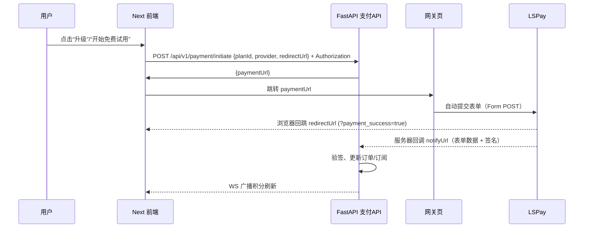

# 支付系统技术与流程规范

版本：v1.0.0  
最后更新时间：2025-12-12  
来源：当前代码库（路径与行号标注）、现有文档与测试结果

---

## 摘要
本规范总结多租户计费与支付系统的架构、升级跳转流程、API 契约、安全与性能建议、测试覆盖及术语定义。面向前后端工程师与运维人员，用于开发、联调与长期维护。

---

## 系统架构
### 组件与端口
- 后端（FastAPI）`http://localhost:8001/`：支付路由与回调、订单与订阅处理（支付/apps/server）
- 前端（Next）`http://localhost:3000/`：升级入口与成功提示（deep main html/deep_agent0.1-main/frontend）
- 前端（Vite）`http://localhost:5173/`：支付模块独立演示（支付/apps/web）
- 后端（NestJS）`http://localhost:4000/`：Agent 平台服务（deep main html/deep_agent0.1-main/backend）
- WebSocket：`/ws/{org_id}` 推送积分刷新（支付/apps/server/main.py:42–51）

### 依赖与环境变量
- LSPay：`LSPAY_API_BASE_URL`、`LSPAY_MEMBER_ID`、`LSPAY_APP_KEY`、`LSPAY_NOTIFY_URL`、`LSPAY_CALLBACK_URL`（支付/apps/server/services/lspay_service.py:13–20）
- CORS：当前放开（生产需收敛）（支付/apps/server/main.py:24–30）

### 架构图
```mermaid
flowchart LR
  A[Next 前端 3000] -- 升级触发 --> B[FastAPI 支付 API 8001]
  B -- 返回网关页 URL --> A
  A -- 跳转 --> C[后端网关页 /payment/gateway/{order_id}]
  C -- 表单自动提交 --> D[LSPay 收银台]
  D -- 浏览器回跳 redirectUrl --> A
  D -- 服务器回调 notifyUrl --> B
  B -- 更新订单/订阅 & WS广播 --> A
```

---

## 升级与支付跳转流程
### 顺序图


### 前端触发示例（来源与语言标注）
```ts
// deep main html/deep_agent0.1-main/frontend/src/pages/chat.tsx:146–169
const handleSelectPlan = async (planId: string, billingCycle: 'monthly' | 'yearly') => {
  setShowPricingModal(false)
  try {
    const res = await fetch('http://localhost:8001/api/v1/payment/initiate', {
      method: 'POST',
      headers: { 'Content-Type': 'application/json', 'Authorization': `Bearer ${ORG_ID}` },
      body: JSON.stringify({ planId, provider: 'alipay', redirectUrl: 'http://localhost:3000/chat?payment_success=true' })
    })
    if (res.ok) {
      const data = await res.json()
      if (data.paymentUrl) window.location.href = data.paymentUrl
    } else {
      console.error('Payment initiation failed:', await res.text())
      alert('无法启动支付会话，请稍后重试。')
    }
  } catch (e) {
    console.error('Error initiating payment:', e)
    alert('支付服务连接失败。')
  }
}
```

---

## API 规范
### 接口清单（来源与更新时间：2025-12-12）
| 方法 | 路径 | 请求 | 响应 | 源码位置 | 说明 |
|---|---|---|---|---|---|
| POST | `/api/v1/payment/check-eligibility` | `CheckEligibilityRequest { planId }` | `CheckEligibilityResponse { isEligible, reason?, currentPlan?, upgradePrice? }` | 支付/apps/server/controllers/payment_controller.py:38–70 | 校验当前组织是否可升级 |
| POST | `/api/v1/payment/initiate` | `InitiatePaymentRequest { planId, provider, redirectUrl }` + `Authorization: Bearer <org_id>` | `InitiatePaymentResponse { orderId, paymentUrl, expireAt, amount, provider }` | 支付/apps/server/controllers/payment_controller.py:72–139 | 创建订单并返回网关页 URL |
| GET | `/api/v1/payment/gateway/{order_id}` | `path: order_id` | `HTML`（自动提交表单至 LSPay） | 支付/apps/server/controllers/payment_controller.py:141–184 | 服务端网关页中转 |
| POST | `/api/v1/payment/callback/lspay` | `FormData`（含签名） | 文本：`"OK"` 或 `"fail"` | 支付/apps/server/controllers/payment_controller.py:186–260 | 服务器回调处理与订阅更新 |
| GET | `/api/v1/payment/orders` | `query: org_id?` | `OrderResponse[]` | 支付/apps/server/controllers/payment_controller.py:31–36 | 查询订单列表 |
| WS | `/ws/{org_id}` | — | JSON 广播（`payment_success`/`credit_update`） | 支付/apps/server/main.py:42–51 | 支付成功后推送刷新 |

### 统一下单与签名（LSPay）
```python
# 支付/apps/server/services/lspay_service.py:87–99
params = {
  "pay_memberid": self.config.member_id,
  "pay_orderid": order_id,
  "pay_applydate": now,
  "pay_bankcode": bank_code,  # 903: Alipay, 902: WeChat
  "pay_notifyurl": self.config.notify_url,
  "pay_callbackurl": order_data.get("callback_url") or self.config.callback_url,
  "pay_amount": f"{amount:.2f}",
  "pay_productname": product_name,
}
params["pay_md5sign"] = self._generate_signature(params)
```

---

## 安全与性能
### 安全
- 签名算法：过滤空值与签名字段，按键排序，拼接并追加 `&key=<APP_KEY>`，MD5 大写（支付/apps/server/services/lspay_service.py:41–59）。
- 环境变量：`member_id/app_key` 必须在生产有效；缺失需拒绝下单（当前为警告 + 返回失败）。
- 鉴权：`Authorization: Bearer <org_id>` 提供组织上下文，演示回退值需在生产禁用（支付/apps/server/controllers/payment_controller.py:23–30）。
- CORS：生产限制来源域；当前项目为开发模式全开放（支付/apps/server/main.py:24–30）。

### 性能
- 网关页二次调用统一下单可能重复生成参数；建议在订单持久化 `bank_code/callback_url` 并在网关页复用，避免不一致与外部速率限制。
- WebSocket 启动警告提示缺少依赖，可安装 `uvicorn[standard]` 与 `websockets` 提升稳定性。

---

## 测试与覆盖率
### 集成测试
- 文件：`支付/apps/server/tests/test_payment_integration.py`
- 覆盖：初始化数据、资格校验、发起支付、模拟回调、订阅更新与断言。
- 运行：
```bash
# Windows PowerShell
py tests\test_payment_integration.py
```

### 前端用例建议
- 为升级按钮交互添加契约测试：成功分支（跳转 `paymentUrl`）、失败分支（提示 + 打印响应文本）。
- 对 `payment_success=true` 回跳参数的提示与积分刷新逻辑进行断言。

---

## 术语表
- **bank_code**：支付渠道代码；`903` 代表支付宝、`902` 代表微信（支付/apps/server/controllers/payment_controller.py:107）。
- **notify_url**：服务器回调地址（异步，后端接收并落库）。（支付/apps/server/services/lspay_service.py:18）
- **callback_url**：浏览器回跳地址（同步，用户支付完成后返回前端页面）。（支付/apps/server/services/lspay_service.py:19, 93–94）
- **paymentUrl**：后端返回的网关页地址（HTML 自动提交到 LSPay），供前端完整跳转使用。（支付/apps/server/controllers/payment_controller.py:115, 121–127）

---

## 变更日志
- v1.0.0（2025-12-12）
  - 对齐前端发起接口至 `/api/v1/payment/initiate`，并携带 `Authorization` 与 `redirectUrl`。
  - 服务端透传 `redirectUrl` 用于 LSPay 的 `pay_callbackurl`。
  - 新增文档与目录规范说明，归档测试与脚本。

---

## 历史版本
- 文档采用单文件迭代维护；重大变更记录于“变更日志”章节。
- 若需存档旧版，可复制为 `docs/archive/支付系统技术与流程规范_vX.Y.Z.md`。

---

## 参考链接
- 支付控制器：`支付/apps/server/controllers/payment_controller.py`
- LSPay 服务：`支付/apps/server/services/lspay_service.py`
- 测试套件：`支付/apps/server/tests/`
- 目录结构说明：`支付/docs/文件结构说明.md`
- 整理报告：`支付/docs/整理报告.md`

---

> 注：所有路径与行号引用与时间戳对应代码库当前状态（最后更新时间：2025-12-12）。
